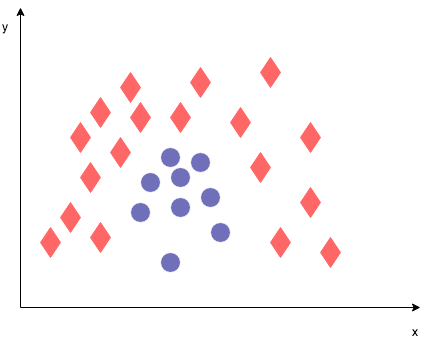
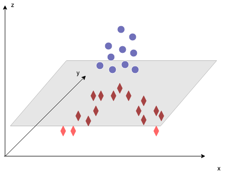

# The Kernel Trick

## Introduction

In this lesson, you'll learn how to create SVMs for linearly non-separable data using kernels!

## Objectives
You will be able to:
- Understand what the Kernel Trick is and why it is important
- Explain what a Radial Basis Function Kernel is
- Explain what a Sigmoid Kernel is
- Explain what a Polynomial Kernel is
- Apply several non-linear kernel functions in scikit-learn

## Non-linear problems: the kernel trick

In the previous lab, we looked at a plot where a linear boundary was clearly not sufficient to separate between the two classes. Another example of where a linear boundary would not work well is shown below. How would you draw a max margin classifier here? We could do it easily by hand, but we cannot draw a **straight line**. Luckily there is a fairly easy solution, which is denoted by kernelizing your problem such that you can solve non-linear classification problems. Here, we'll introduce kernels.

The idea behind kernel methods to deal with linearly inseparable data is to create (nonlinear) combinations of the original features, and project them on a higher-dimensional space. As shown in the following  figure, we can then   separate the cases by transforingm a two-dimensional dataset onto a new three-dimensional feature space.

## Types of kernels

There are several Kernels, and an overview can be found in this lesson, as well as in the scikit-learn documentation [here](https://scikit-learn.org/stable/modules/svm.html#kernel-functions). The idea is that kernels are inner products in a transformed space. 

### The linear kernel

The linear kernel is, as we've seen, the default kernel and simply creates linear decision boundaries. The linear kernel is represented by the inner product of the $\langle x, x' \rangle$. It is not very important to really understand what's happening here, we just wanted to give the expression because you'll get the expressions for other kernels as well. As some kernels have additional parameters that can be specified, it is important to know about them.

### The RBF kernel

There are two parameters when training an SVM with the Radial Basis Function: C and gamma. 

- The parameter C is common to all SVM kernels. Again, by tuning the C parameter when using kernels, you can provide a trafe-off between misclassification of the training set and simplicity of the decision function. a high C will classify as many samples correctly as possible (and might potentially lead to overfitting).

- Gamma defines how much influence a single training example has. The larger gamma is, the closer other examples must be to be affected.

The RBF kernel is specified as 

$$\exp{(-\gamma \lVert  x -  x' \rVert^2)} $$

Gamma has a strong effect on the results: gamma too large will lead to overfitting, a gamma which is too small will lead to underfitting (kind of like a simple linear boundary for a complex problem)

In scikit-learn, you can specify a value for gamma using the attribute `gamma`. The default gamma value is "auto", if no other gamma is specified, gamma is set to 1/number_of_features (so, 0.5 if 2 classes, 0.333 when 3 classes, etc.). More on parameters in the RBF kernel [here](https://scikit-learn.org/stable/auto_examples/svm/plot_rbf_parameters.html).

### The Polynomial kernel

The Polynomial kernel is specified as 

$$(\gamma \langle  x -  x' \rangle+r)^d $$

- d can be specified by the keyword `degree`. The default degree is 3. 
- r can be specified by the keyword `coef0`. The default is 0.

### The Sigmoid kernel

The sigmoid kernel is specified as: 

$$\tanh ( \gamma\langle  x -  x' \rangle+r) $$

This kernel is similar to the signoid function in logistic regression.

## Some more notes on SVC, NuSVC and LinearSVC

We explored the differences between SVC, NuSVC and LinearSVC in the previous lab, but let's formalize it once more here:

### NuSVC

NuSVC is similar to SVC, but accepts slightly defferent parameters, and the mathematical formulation is also altered slightly. 

A new parameter $\nu$ is introduced. The parameter controls the number of support vectors and training errors. $\nu$ jointly creates an upper bound on training errors, and a lower bound on support vectors

Just like SVC, NuSVC implements the "one-against-one" approach when there are more than 2 classes. This means that when there are n classes, $\dfrac{n*(n-1)}{2}$ classifiers are created, and each one classifies samples in 2 classes. 

### LinearSVC

LinearSVC is similar to SVC, but instead of the "one-versus-one" method, a "one-vs-rest" method is used. So in this case, when there are n classes, just $n$ classifiers are created, and each one classifies samples in 2 classes, the one of interest, and all the other classes. This means that SVC generates more classifiers, so in cases with many classes, LinearSVC actually tends to scale better. 

## Probabilities and predictions 

You can make predictions using support vector machines. The SVC decision function gives a probability score per class. This is not done by default, however, You'll need to set the `probability` argument equal to `True`. Scikit-learn internally performs cross-validations to compute the probabilities, so you can expect that setting `probability` to `True` makes the calculations longer. For large data sets, computation times can take considerable proportions.

## Additional materials

To get a better understanding of kernels, have a look at [this video](https://www.youtube.com/watch?v=9IfT8KXX_9c).

## Summary

Great! You now know how you can use kernel functions in Support Vector Machines. Let's contrast and compare some of the kernel functions in the next lab!
